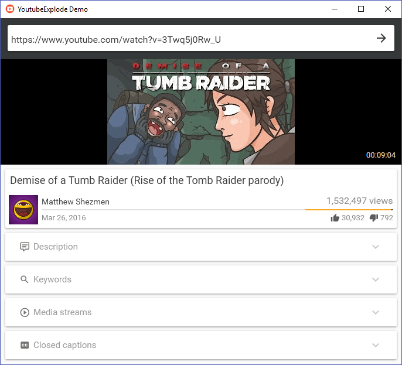

# YoutubeExplode

[](https://ci.appveyor.com/project/Tyrrrz/YoutubeExplode/branch/master)
[](https://ci.appveyor.com/project/Tyrrrz/YoutubeExplode/branch/master/tests)
[](https://codecov.io/gh/Tyrrrz/YoutubeExplode)
[](https://nuget.org/packages/YoutubeExplode)
[](https://nuget.org/packages/YoutubeExplode)
[](https://patreon.com/tyrrrz)
[](https://buymeacoffee.com/tyrrrz)

YoutubeExplode is a library that provides an interface to query metadata of YouTube videos, playlists and channels, as well as to resolve and download video streams and closed caption tracks. Behind a layer of abstraction, the library parses raw page content and uses reverse-engineered AJAX requests to retrieve information. As it doesn't use the official API, there's also no need for an API key and there are no usage quotas.

## Download

- [NuGet](https://nuget.org/packages/YoutubeExplode): `dotnet add package YoutubeExplode`
- [Continuous integration](https://ci.appveyor.com/project/Tyrrrz/YoutubeExplode)

## Features

- Retrieves information about videos, playlists, channels, media streams and closed caption tracks
- Handles all types of videos, including legacy, signed, restricted, non-embeddable and unlisted videos
- Works with media streams of all types -- muxed, embedded adaptive, dash adaptive
- Downloads videos by exposing their media content as a stream
- Supports media stream seeking and segmentation to circumvent throttling
- Parses and downloads closed caption tracks
- All metadata properties are exposed using strong types and enums
- Provides static methods to validate IDs and to parse IDs from URLs
- Fully asynchronous API
- Targets .NET Framework 4.5+ and .NET Standard 1.1+
- No need for an API key and no usage quotas

## Screenshots



## Usage

YoutubeExplode has a single entry point, the `YoutubeClient` class -- all available integration API can be accessed by calling methods of this class.

A lot of helper methods are provided as extensions for models, make sure to include corresponding `using` statements to see them.

Media streams come in 3 forms -- `Muxed` (video & audio), `Audio` (audio only) and `Video` (video only). Highest qualities are not available in muxed streams so you'll have to download separate streams and multiplex them yourself using tools like [ffmpeg](https://www.ffmpeg.org/).

You can also use [YoutubeExplode.Converter](https://github.com/Tyrrrz/YoutubeExplode.Converter) to take care of multiplexing for you.

### Parse ID from URL

Most methods require video/playlist/channel ID which you can extract from any valid URL using one of the static parse methods.

```c#
var url = "https://www.youtube.com/watch?v=bnsUkE8i0tU";
var id = YoutubeClient.ParseVideoId(url); // "bnsUkE8i0tU"
```

### Get video info

You can get video metadata by passing its ID to `GetVideoAsync` method.

```c#
var client = new YoutubeClient();

var video = await client.GetVideoAsync("bnsUkE8i0tU");

var title = video.Title; // "Infected Mushroom - Spitfire [Monstercat Release]"
var author = video.Author; // "Monstercat"
var duration = video.Duration; // 00:07:14
```

### Download video

If you want to download a video, you first need to get info on all its streams using `GetVideoMediaStreamInfosAsync`, then choose the stream you want to download, then pass it to `DownloadMediaStreamAsync` method. You can also use `GetMediaStreamAsync` to get the stream itself.

Keep in mind that the streams are split into Muxed (audio+video), Audio (audio only) and Video (video only).

```c#
var client = new YoutubeClient();

// Get metadata for all streams in this video
var streamInfoSet = await client.GetVideoMediaStreamInfosAsync("bnsUkE8i0tU");

// Select one of the streams, e.g. highest quality muxed stream
var streamInfo = streamInfoSet.Muxed.WithHighestVideoQuality();

// ...or highest bitrate audio stream
// var streamInfo = streamInfoSet.Audio.WithHighestBitrate();

// ...or highest quality & highest framerate MP4 video stream
// var streamInfo = streamInfoSet.Video
//    .Where(s => s.Container == Container.Mp4)
//    .OrderByDescending(s => s.VideoQuality)
//    .ThenByDescending(s => s.Framerate)
//    .First();

// Get file extension based on stream's container
var ext = streamInfo.Container.GetFileExtension();

// Download stream to file
await client.DownloadMediaStreamAsync(streamInfo, $"downloaded_video.{ext}");
```

### Extract closed captions

Similarly to streams, you can extract closed captions by getting the info on all available tracks using `GetVideoClosedCaptionTrackInfosAsync`, choosing the one you're interested in, then resolving it with `GetClosedCaptionTrackAsync`. If you want, you can also download the track as an SRT file by calling `DownloadClosedCaptionTrackAsync`.

```c#
var client = new YoutubeClient();

// Get metadata for all closed caption tracks in this video
var trackInfos = await client.GetVideoClosedCaptionTrackInfosAsync("_QdPW8JrYzQ");

// Select a closed caption track in English (assuming it exists)
var trackInfo = trackInfos.First(t => t.Language.Code == "en");

// Resolve the closed caption track
var track = await client.GetClosedCaptionTrackAsync(trackInfo);

// Get the caption displayed at 1:01
var caption = track.GetByTime(TimeSpan.FromSeconds(61));
var text = caption.Text; // "And the game was afoot."
```

### Get playlist info

YoutubeExplode is not limited to just videos so you can also use it to get the contents of a playlist and all associated metadata by calling `GetPlaylistAsync` method.

```c#
var client = new YoutubeClient();

var playlist = await client.GetPlaylistAsync("PLQLqnnnfa_fAkUmMFw5xh8Kv0S5voEjC9");

var title = playlist.Title; // "Igorrr - Hallelujah"
var author = playlist.Author; // "randomusername604"

var video = playlist.Videos.First();
var videoTitle = video.Title; // "Igorrr - Tout Petit Moineau"
var videoAuthor = video.Author; // "Igorrr Official"
```

## Etymology

The "Explode" in YoutubeExplode comes from the name of a PHP function that splits up strings, [`explode()`](https://www.php.net/manual/en/function.explode.php). When I was just starting development on this library, most of the reference source code I read was written in PHP, hence the inspiration for the name.

## Libraries used

- [LtGt](https://github.com/Tyrrrz/LtGt)
- [Newtonsoft.Json](https://github.com/JamesNK/Newtonsoft.Json)
- [GalaSoft.MVVMLight](http://www.mvvmlight.net)
- [MaterialDesignInXamlToolkit](https://github.com/ButchersBoy/MaterialDesignInXamlToolkit)
- [NUnit](https://github.com/nunit/nunit)
- [Coverlet](https://github.com/tonerdo/coverlet)
- [Tyrrrz.Extensions](https://github.com/Tyrrrz/Extensions)

## Donate

If you really like my projects and want to support me, consider donating to me on [Patreon](https://patreon.com/tyrrrz) or [BuyMeACoffee](https://buymeacoffee.com/tyrrrz). All donations are optional and are greatly appreciated. 🙏